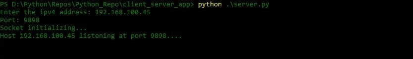
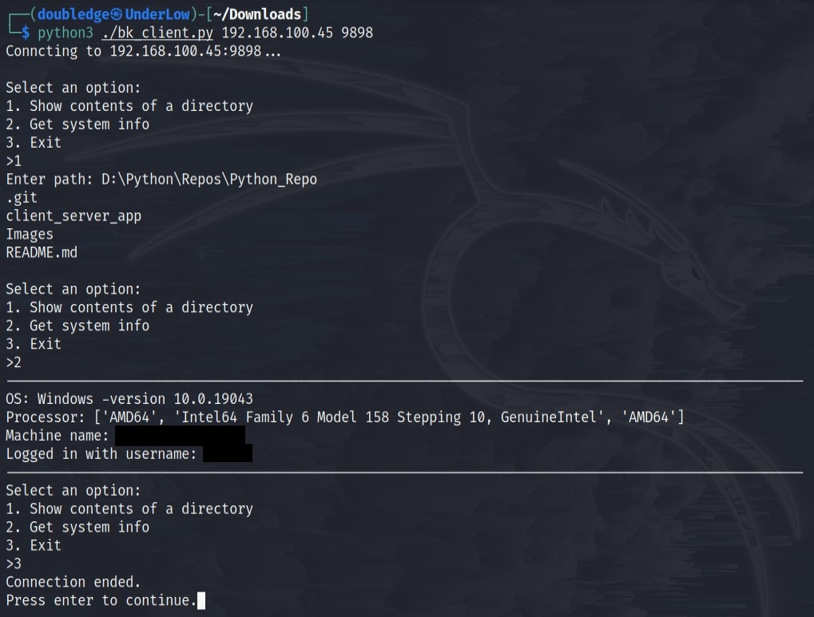
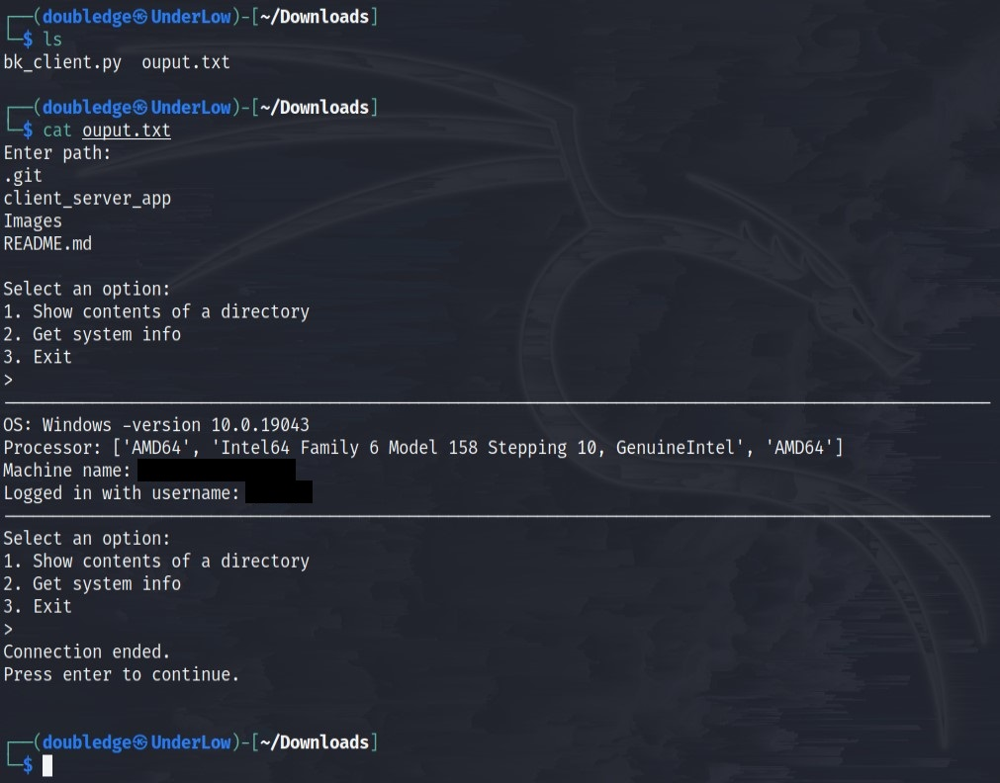

# Client-Server Python App
The application was implemented with the purpose of learning, and it simulates
a functional data transfer app from a server to a client.

## Demo

To show the functionalities, for this example the server is running on 
a Windows machine and the client on a Linux operating system.

On the server side after executing the script the host is listening to the ipv4 address and port 
that were specified.

Then the client starts the program providing the target host ipv4 address
and port as arguments, then the user has available an interactive and simple to use menu.

The client can find out the host's files and folders and part of its 
system information.

An output file is automatically created, and it stores all the data
that has been gathered from the server.

